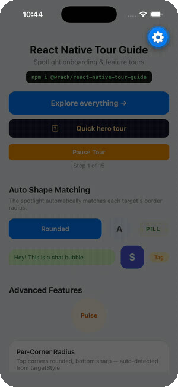
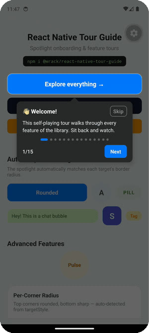
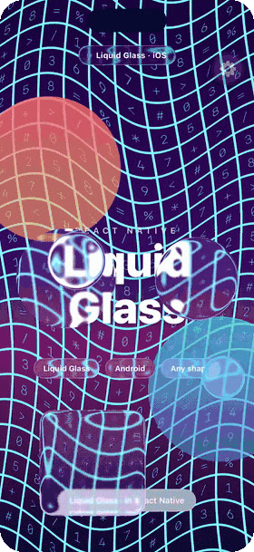
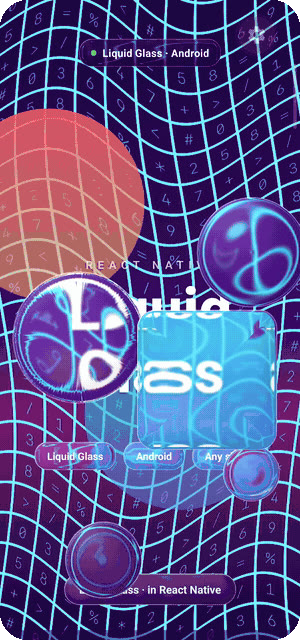

<h1 align="center">Hey 👋, I'm Wrack</h1>

  <b>SOFTWARE ENGINEER &nbsp;·&nbsp; MOBILE &amp; WEB APPS &nbsp;·&nbsp; REACT NATIVE (SWIFT, KOTLIN) &nbsp;·&nbsp; OPEN SOURCE</b>

  
  
  
  
  
  
  

---

### About

I build React Native apps, and the open-source libraries that go inside them.

- 📱 Shipping a production health app on **iOS and Android** — 40+ releases, and I own both store pipelines
- ⚙️ Led a **React Native 0.68 → 0.80** upgrade and migrated native modules from Java/Obj-C to **Kotlin and Swift**
- 📦 My libraries are installed **~7,000 times a month** on npm
- 🌙 Building **[SnoozeWar](https://snoozewar.com)** — an app that fixes your sleep–wake cycle
- ✍️ I write about native shaders and RN internals on **[dev.to](https://dev.to/wrack)**

---

### Tech Stack

**Languages**

**Mobile & Web**

**Backend & Data**

**Testing, CI/CD & Tooling**

---

### Live Demos

<table>
<tr>
<td align="center" width="25%"> <b>Tour Guide · iOS</b></td>
<td align="center" width="25%"> <b>Tour Guide · Android</b></td>
<td align="center" width="25%"> <b>Liquid Glass · iOS</b></td>
<td align="center" width="25%"> <b>Liquid Glass · Android</b></td>
</tr>
</table>

---

### Projects

<table>
<tr>
<td width="50%" valign="top">

#### [react-native-tour-guide](https://github.com/himanshu-lal4/react-native-tour-guide)

Spotlight onboarding, walkthroughs and coach marks. Auto shape-matching SVG masks, smart auto-scroll, themeable tooltips. Zero native dependencies.

</td>
<td width="50%" valign="top">

#### [react-native-liquid-glassmorphism](https://github.com/himanshu-lal4/react-native-liquid-glassmorphism)

Liquid glass on both platforms. `UIGlassEffect` on iOS, hand-written AGSL refraction shaders on Android. New Architecture ready.

</td>
</tr>
<tr>
<td width="50%" valign="top">

#### 🌙 [SnoozeWar](https://snoozewar.com)

An app that fixes your sleep–wake cycle using what sleep science says actually works. Escape-resistant wake-up missions, bedtime app blocking, sleep-debt tracking. Built solo — product, app, backend, launch.

</td>
<td width="50%" valign="top">

#### 🎨 [Design System Auditor](https://www.figma.com/community/plugin/1604611697351063503/figma-design-system-auditor)

Figma plugin that scores a file's AI-readiness 0–100 and fixes detached styles and token drift, so code generation from Figma actually works.

</td>
</tr>
</table>

---

### GitHub Stats

  

  

---

  <a href="https://wrack.dev">wrack.dev</a>

