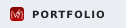
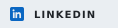
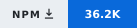
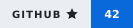
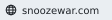

  <picture>
    <source media="(prefers-color-scheme: dark)" srcset="assets/sections/dark/typewriter.svg">
    
  </picture>

  <b>SOFTWARE ENGINEER &nbsp;·&nbsp; MOBILE &amp; WEB APPS &nbsp;·&nbsp; REACT NATIVE (SWIFT, KOTLIN) &nbsp;·&nbsp; OPEN SOURCE</b>

  <a href="https://wrack.dev"><picture><source media="(prefers-color-scheme: dark)" srcset="assets/badges/portfolio-dark.svg"></picture></a>
  <a href="https://wrack.dev/resume"><picture><source media="(prefers-color-scheme: dark)" srcset="https://img.shields.io/badge/Resume-21262D?style=for-the-badge&logo=readdotcv&logoColor=white"></picture></a>
  <a href="https://linkedin.com/in/himanshulal4"><picture><source media="(prefers-color-scheme: dark)" srcset="assets/badges/linkedin-dark.svg"></picture></a>
  <a href="https://www.npmjs.com/~wrack"><picture><source media="(prefers-color-scheme: dark)" srcset="https://img.shields.io/badge/npm-21262D?style=for-the-badge&logo=npm&logoColor=F2544B"></picture></a>
  <a href="https://peerlist.io/wrack"><picture><source media="(prefers-color-scheme: dark)" srcset="https://img.shields.io/badge/Peerlist-21262D?style=for-the-badge&logo=peerlist&logoColor=2ED26B"></picture></a>
  <a href="https://dev.to/wrack"><picture><source media="(prefers-color-scheme: dark)" srcset="https://img.shields.io/badge/dev.to-21262D?style=for-the-badge&logo=devdotto&logoColor=white"></picture></a>
  <a href="mailto:himanshulal56@gmail.com"><picture><source media="(prefers-color-scheme: dark)" srcset="https://img.shields.io/badge/Email-21262D?style=for-the-badge&logo=gmail&logoColor=EA4335"></picture></a>

---

<picture>
  <source media="(prefers-color-scheme: dark)" srcset="assets/sections/dark/01-about.svg">
  
</picture>

**I build mobile apps, web apps, and open-source developer tools.**

Currently a Software Engineer & Release Manager at [Tap Health](https://tap.health), an author of open-source developer tools published on [npm](https://www.npmjs.com/~wrack), and founder of [SnoozeWar](https://snoozewar.com). I ship mobile and web apps, drop down to native code when the platform demands it, and own the release pipeline to both stores.

- 📚 I'm currently learning **everything** 🤣
- 🤝 Open to collaborating on **open-source projects**
- 💡 Always open to **new ideas worth building** — [let's connect](mailto:himanshulal56@gmail.com)
- 🌱 Contributors welcome — see the roadmaps on [tour-guide](https://github.com/himanshu-lal4/react-native-tour-guide/issues/9) and [liquid-glass](https://github.com/himanshu-lal4/react-native-liquid-glassmorphism/issues/23)

---

<picture>
  <source media="(prefers-color-scheme: dark)" srcset="assets/sections/dark/02-profiles.svg">
  
</picture>

  &nbsp;&nbsp;&nbsp;
  &nbsp;&nbsp;&nbsp;
  &nbsp;&nbsp;&nbsp;
  &nbsp;&nbsp;&nbsp;
  &nbsp;&nbsp;&nbsp;
  &nbsp;&nbsp;&nbsp;
  &nbsp;&nbsp;&nbsp;
  &nbsp;&nbsp;&nbsp;
  &nbsp;&nbsp;&nbsp;

---

<picture>
  <source media="(prefers-color-scheme: dark)" srcset="assets/sections/dark/03-connect.svg">
  
</picture>

  &nbsp;&nbsp;&nbsp;
  &nbsp;&nbsp;&nbsp;
  &nbsp;&nbsp;&nbsp;
  &nbsp;&nbsp;&nbsp;
  &nbsp;&nbsp;&nbsp;
  &nbsp;&nbsp;&nbsp;

---

<picture>
  <source media="(prefers-color-scheme: dark)" srcset="assets/sections/dark/04-support.svg">
  
</picture>

  <a href="https://github.com/sponsors/himanshu-lal4"><picture><source media="(prefers-color-scheme: dark)" srcset="https://img.shields.io/badge/GitHub_Sponsors-21262D?style=for-the-badge&logo=githubsponsors&logoColor=EA4AAA"></picture></a>
  <a href="https://buymeacoffee.com/wrack"><picture><source media="(prefers-color-scheme: dark)" srcset="https://img.shields.io/badge/Buy_Me_a_Coffee-21262D?style=for-the-badge&logo=buymeacoffee&logoColor=FFDD00"></picture></a>

  If my work saves you time, supporting it keeps it maintained.

---

<picture>
  <source media="(prefers-color-scheme: dark)" srcset="assets/sections/dark/05-telemetry.svg">
  
</picture>

  

  <a href="https://www.npmjs.com/~wrack"><picture><source media="(prefers-color-scheme: dark)" srcset="assets/badges/installs-dark.svg"></picture></a>
  <a href="https://github.com/himanshu-lal4?tab=repositories"><picture><source media="(prefers-color-scheme: dark)" srcset="assets/badges/stars-dark.svg"></picture></a>

  <picture>
    <source media="(prefers-color-scheme: dark)" srcset="https://github-profile-summary-cards.vercel.app/api/cards/profile-details?username=himanshu-lal4&theme=github_dark">
    
  </picture>

  <picture>
    <source media="(prefers-color-scheme: dark)" srcset="https://github-profile-summary-cards.vercel.app/api/cards/stats?username=himanshu-lal4&theme=github_dark">
    
  </picture>
  <picture>
    <source media="(prefers-color-scheme: dark)" srcset="https://github-profile-summary-cards.vercel.app/api/cards/productive-time?username=himanshu-lal4&theme=github_dark&utcOffset=5.5">
    
  </picture>

  

  <picture>
    <source media="(prefers-color-scheme: dark)" srcset="assets/snake-dark.svg">
    
  </picture>

---

<picture>
  <source media="(prefers-color-scheme: dark)" srcset="assets/sections/dark/06-open-source.svg">
  
</picture>

<table>
<thead>
<tr>
<th align="center" width="34%">Project</th>
<th align="center">⭐ Stars</th>
<th align="center">🍴 Forks</th>
<th align="center">📦 Installs</th>
<th align="center">🔀 Merged PRs</th>
<th align="center">🐞 Issues</th>
</tr>
</thead>
<tbody>
<tr>
<td align="left"><b><a href="https://github.com/himanshu-lal4/react-native-tour-guide">react-native-tour-guide</a></b></td>
<td align="center"></td>
<td align="center"></td>
<td align="center"></td>
<td align="center"></td>
<td align="center"></td>
</tr>
<tr>
<td align="left"><b><a href="https://github.com/himanshu-lal4/react-native-liquid-glassmorphism">react-native-liquid-glassmorphism</a></b></td>
<td align="center"></td>
<td align="center"></td>
<td align="center"></td>
<td align="center"></td>
<td align="center"></td>
</tr>
</tbody>
</table>

---

<picture>
  <source media="(prefers-color-scheme: dark)" srcset="assets/sections/dark/07-other-projects.svg">
  
</picture>

<table>
<thead>
<tr>
<th align="center" width="26%">Project</th>
<th align="center" width="46%">What it is</th>
<th align="center" width="28%">Links</th>
</tr>
</thead>
<tbody>
<tr>
<td align="left"><b><a href="https://snoozewar.com">&nbsp;SnoozeWar</a></b></td>
<td align="left">Fixes your sleep–wake cycle using what sleep science says works. Escape-resistant wake-up missions, app blocking, sleep-debt tracking. Built solo.</td>
<td align="left"><a href="https://play.google.com/store/apps/details?id=com.snoozewar.app"><picture><source media="(prefers-color-scheme: dark)" srcset="https://img.shields.io/badge/Google_Play-21262D?style=flat-square&labelColor=0D1117&color=21262D&logo=googleplay&logoColor=FFFFFF"></picture></a> <a href="https://snoozewar.com"><picture><source media="(prefers-color-scheme: dark)" srcset="assets/badges/snoozewar-dark.svg"></picture></a></td>
</tr>
<tr>
<td align="left"><b><a href="https://www.figma.com/community/plugin/1604611697351063503/figma-design-system-auditor">🎨&nbsp;Design&nbsp;System&nbsp;Auditor</a></b></td>
<td align="left">Find and fix design-system problems inside Figma. Scores a file's AI-readiness 0–100 and catches detached styles and token drift, so code generation from Figma actually works.</td>
<td align="left"><a href="https://www.figma.com/community/plugin/1604611697351063503/figma-design-system-auditor"><picture><source media="(prefers-color-scheme: dark)" srcset="https://img.shields.io/badge/Figma_Community-21262D?style=flat-square&labelColor=0D1117&color=21262D&logo=figma&logoColor=F24E1E"></picture></a></td>
</tr>
</tbody>
</table>

---

<picture>
  <source media="(prefers-color-scheme: dark)" srcset="assets/sections/dark/08-stack.svg">
  
</picture>

<table>
<thead>
<tr>
<th align="center" width="26%">Area</th>
<th align="center" width="74%">Stack</th>
</tr>
</thead>
<tbody>
<tr>
<td align="left"><b>Languages</b></td>
<td align="left">    </td>
</tr>
<tr>
<td align="left"><b>Mobile &amp; Web</b></td>
<td align="left">    </td>
</tr>
<tr>
<td align="left"><b>Backend &amp; Data</b></td>
<td align="left">     </td>
</tr>
<tr>
<td align="left"><b>Testing &amp; Quality</b></td>
<td align="left">   </td>
</tr>
<tr>
<td align="left"><b>Release &amp; Monitoring</b></td>
<td align="left">      </td>
</tr>
<tr>
<td align="left"><b>AI &amp; Design</b></td>
<td align="left">  </td>
</tr>
</tbody>
</table>

---

  <a href="https://wrack.dev" title="Portfolio, projects and writing">wrack.dev</a>
  &nbsp;·&nbsp;
<a href="https://wrack.dev/resume" title="Resume">resume</a>
  &nbsp;·&nbsp;
<a href="https://snoozewar.com" title="SnoozeWar — sleep-wake enforcement app">snoozewar</a>
  &nbsp;·&nbsp;
<a href="https://www.npmjs.com/~wrack" title="Published packages">npm</a>
  &nbsp;·&nbsp;
<a href="https://github.com/himanshu-lal4?tab=repositories" title="All public repositories">repositories</a>
  &nbsp;·&nbsp;
<a href="https://linkedin.com/in/himanshulal4" title="LinkedIn profile">linkedin</a>
  &nbsp;·&nbsp;
<a href="https://dev.to/wrack" title="Articles on dev.to">writing</a>
  &nbsp;·&nbsp;
<a href="https://github.com/sponsors/himanshu-lal4" title="GitHub Sponsors">github sponsors</a>
  &nbsp;·&nbsp;
<a href="https://buymeacoffee.com/wrack" title="Buy Me a Coffee">buy me a coffee</a>
  &nbsp;·&nbsp;
<a href="mailto:himanshulal56@gmail.com" title="himanshulal56@gmail.com">email</a>

  Badges and telemetry refresh automatically &#8212; nothing on this page is hand-maintained.

